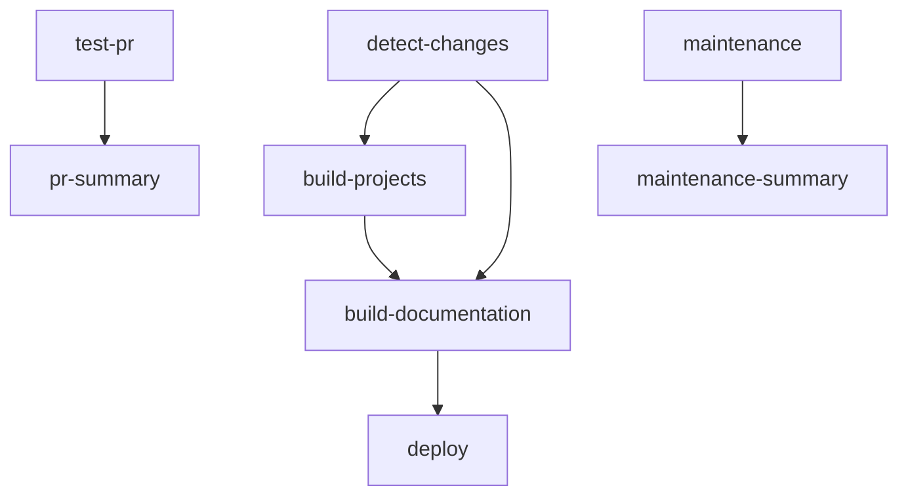

# 🚀 GitHub Actions Workflows

This repository includes comprehensive CI/CD automation using GitHub Actions.

## 📋 Workflow Overview

### 🎮 Main Build Workflow (`build-documentation.yml`)
**Triggers:** Push to main/develop, PRs, manual dispatch
- **Detect Changes**: Analyzes what parts of the system changed
- **Build Projects**: Parallel build of Godot projects by category (2d, 3d, gui, audio, misc)
- **Build Documentation**: Generates documentation site with embeds
- **Deploy**: Automatically deploys to GitHub Pages on main branch

**Features:**
- Smart change detection to avoid unnecessary builds
- Parallel processing for faster builds
- Comprehensive caching for build artifacts
- Manual dispatch with options for force rebuild and target subsets

### 🧪 Test Workflow (`test-pr.yml`)
**Triggers:** Pull requests
- **Build System Tests**: Unit tests and linting
- **Sample Build Test**: End-to-end verification on sample projects
- **Security Scan**: Vulnerability scanning with Trivy
- **Config Validation**: Validates configuration files and scripts

### 🏷️ Release Workflow (`release.yml`)
**Triggers:** Version tags (v*), manual dispatch
- Builds all projects for release
- Generates comprehensive statistics and release notes
- Creates GitHub release with archives
- Deploys to GitHub Pages

### 🧹 Maintenance Workflow (`maintenance.yml`)
**Triggers:** Weekly schedule (Sundays 2 AM UTC), manual dispatch
- **Cache Cleanup**: Removes old GitHub Actions cache entries
- **Dependency Updates**: Checks for Python and Godot updates
- **Project Validation**: Validates project structure and exports
- **Security Audit**: Scans dependencies and code for vulnerabilities

### 📊 Status Badges (`status-badges.yml`)
**Triggers:** After main build workflow completion
- Updates status badges with build results
- Tracks project count and export statistics

## 🔧 Configuration

### Environment Variables
- `GODOT_VERSION`: "4.3" (Godot Engine version)
- `PYTHON_VERSION`: "3.11" (Python runtime version)

### Secrets Required
- `GITHUB_TOKEN`: Automatically provided by GitHub Actions

### Cache Strategy
- **Build cache**: `.build_cache/` directory with project hashes
- **Python packages**: Pip cache for faster dependency installation
- **Godot templates**: Export templates cached between runs

## 🎯 Manual Workflow Dispatch

All workflows support manual triggering with customizable options:

### Build Documentation
```bash
# Force rebuild all projects
gh workflow run build-documentation.yml -f force_rebuild=true

# Build only specific category
gh workflow run build-documentation.yml -f target_subset=2d
```

### Maintenance
```bash
# Run all maintenance tasks
gh workflow run maintenance.yml -f task=all

# Only cleanup cache
gh workflow run maintenance.yml -f task=cleanup-cache
```

### Release
```bash
# Create release
gh workflow run release.yml -f tag_name=v1.0.0
```

## 📊 Build Matrix Strategy

The main build workflow uses a matrix strategy to parallelize builds:

```yaml
strategy:
  matrix:
    subset: ['2d', '3d', 'gui', 'audio', 'misc']
```

Each subset builds its projects in parallel, significantly reducing total build time.

## 🔍 Monitoring and Alerts

### Build Status
- ✅ All workflows provide detailed summaries in GitHub Actions
- 📊 Status badges track build health
- 📈 Release statistics track project metrics over time

### Failure Handling
- 🔄 Workflows continue on individual project failures
- 📝 Detailed logs for debugging
- 🚨 Security scan results uploaded to GitHub Security tab

## 🛠️ Local Testing

To test workflows locally using [act](https://github.com/nektos/act):

```bash
# Test PR workflow
act pull_request -W .github/workflows/test-pr.yml

# Test build workflow
act push -W .github/workflows/build-documentation.yml
```

## 📁 Artifact Management

### Build Artifacts
- **Retention**: 7 days for exports, 3 days for logs
- **Structure**: Organized by project category
- **Size**: Compressed archives for efficient storage

### Release Artifacts
- **Retention**: Permanent (attached to GitHub releases)
- **Format**: tar.gz archives with full documentation site
- **Metadata**: JSON statistics file with build information

## 🔄 Workflow Dependencies



## 📈 Performance Optimizations

1. **Parallel Processing**: Matrix strategy for project categories
2. **Smart Caching**: Multi-level cache for dependencies and builds
3. **Change Detection**: Only builds when necessary
4. **Incremental Builds**: Uses checksums to skip unchanged projects
5. **Artifact Compression**: Efficient storage and transfer

This CI/CD setup ensures reliable, fast, and automated building and deployment of the Godot Examples Documentation system.
