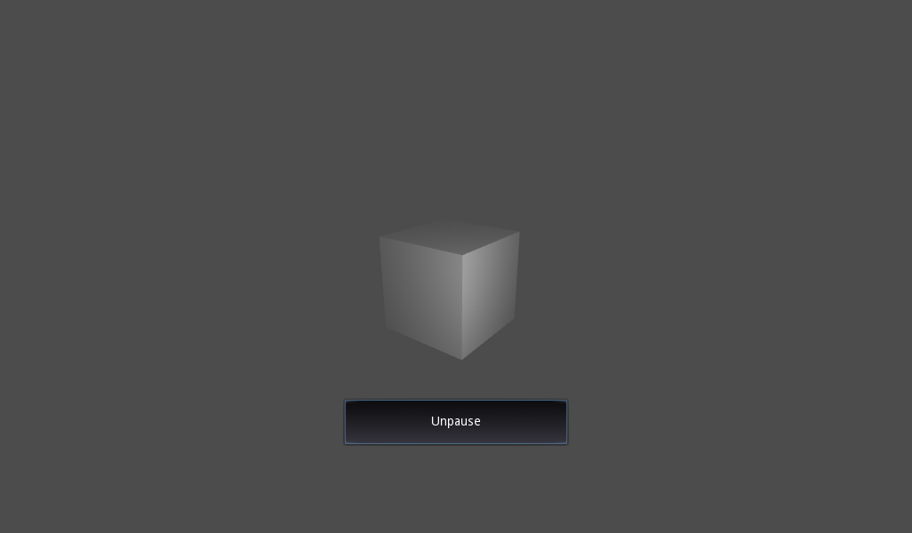

# Pause Demo

    

        

            <iframe 
                src="godot-demo-projects/misc/pause/exports/web/index.html" 
                width="800" 
                height="600"
                frameborder="0"
                allowfullscreen
                style="width: 100%; height: 600px; border: 2px solid #478cbf; border-radius: 8px;">
            </iframe>
            

                <button onclick="toggleFullscreen()" class="control-btn">⛶ Fullscreen</button>
                <button onclick="reloadGame()" class="control-btn">🔄 Reload</button>
                <a href="godot-demo-projects/misc/pause/exports/web/index.html" target="_blank" class="control-btn">🔗 Open in New Tab</a>
            

        

    

    
    
    
    
    

A demo showing how a game made in Godot can be paused.

Language: GDScript

Renderer: Compatibility

Check out this demo on the asset library: https://godotengine.org/asset-library/asset/2790

## Screenshots

